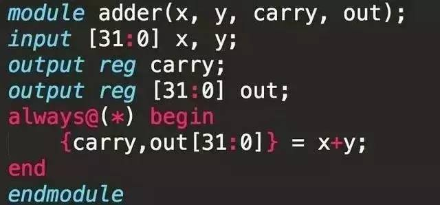

# 名词解释

## `HDL`=`Hardware Description Language`=`硬件描述语言`

在电子学中，硬件描述语言（英语：hardware description language, HDL）是用来描述电子电路（特别是数字电路）功能、行为的语言，可以在寄存器传输级、行为级、逻辑门级等对数字电路系统进行描述。随着自动化逻辑综合工具的发展，硬件描述语言可以被这些工具识别，并自动转换到逻辑门级网表，使得硬件描述语言可以被用来进行电路系统设计，并能通过逻辑仿真的形式验证电路功能。设计完成后，可以使用逻辑综合工具生成低抽象级别（门级）的网表（即连线表）

硬件描述语言在很多地方可能和传统的软件编程语言类似，但是最大的区别是，前者能够对于硬件电路的时序特性进行描述。硬件描述语言是构成电子设计自动化体系的重要部分。小到简单的触发器，大到复杂的超大规模集成电路（如微处理器），都可以利用硬件描述语言来描述。常见的硬件描述语言包括`Verilog`、`VHDL`等

## `Verilog`语言

举例：

`四选一的多路选择器`

对应的代码：

```verilog
module mux(out,select,in0,in1,in2,in3);
output out;
input [1:0]select;
input in0,in1,in2,in3;
//具体的寄存器传输级代码
endmodule
```

语法高亮后：



