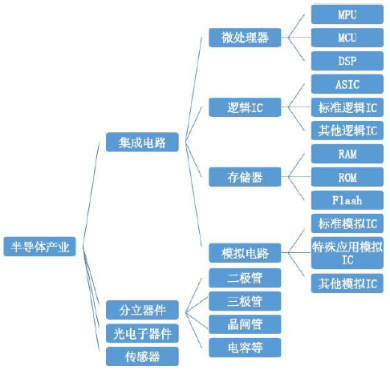
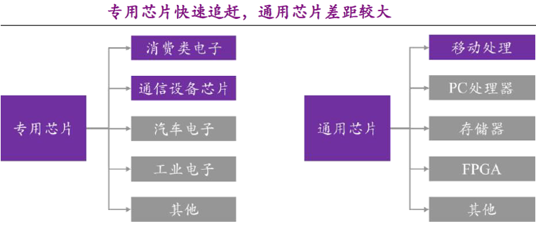

# 芯片分类

## 用**人**去类比，根据功能划分

再去根据芯片的功能类型，用人体去类比解释的不同功能的芯片：

拆解的**电子设备**，就像一个有机的整体：**人体**

* 思考的大脑
  * 主控芯片
    * CPU/SoC/FPGA/MCU
  * 辅助芯片
    * 图形图像处理的
      * GPU
    * 人工智能计算的
      * AI芯片
* 存储的脑皮层
  * Nand Flash/ SD/MMC
* 供能的心脏
  * 电源芯片=电源管理芯片=电压转换芯片=功率芯片
    * DC-DC
    * LDO
* 传递信息的神经
  * 无线
    * WiFi
    * 蓝牙
    * NB-IOT
  * 有线
    * LAN
* 感知的五官
  * 各种传感器
    * 手的触觉
      * 指纹芯片
    * 听的耳朵
      * 麦克风
    * 看的眼睛
      * 摄像头
    * 方向的
      * 指南针
    * 等等
* 控制和驱动 各个肢体
  * 各个外设的控制器
* 不同的肢体
  * 不同的外设
    * USB
    * 有线的以太网
    * HDMI接口

### 以天猫精灵方糖为例用人体类比芯片功能

举例：[智能音箱拆解总结 天猫精灵方糖拆解报告和BOM](http://book.crifan.com/books/smart_speaker_disassemble_summary/website/tmall_genie_candy_cube/chip_info_research/disassembly_report_bom.html)

效果是：

## 从产业链角度划分

* 半导体产业
  * 集成电路
    * 微处理器
      * MPU
      * MCU
      * DSP
      * ASIC
    * 逻辑IC
      * 标准逻辑IC
      * 其他逻辑IC
    * 存储器
      * RAM
      * ROM
      * Flash
    * 模拟电路
      * 标准模拟IC
      * 特殊应用模拟IC
      * 其他模拟IC
  * 分立器件
    * 二极管
    * 三极管
    * 晶闸管
    * 电容等
  * 光电子器件
  * 传感器

## 根据用途划分

