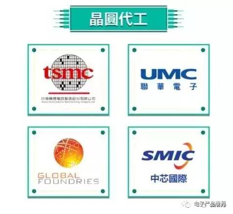
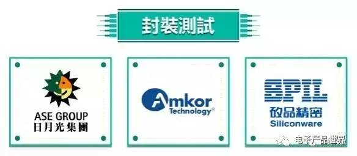
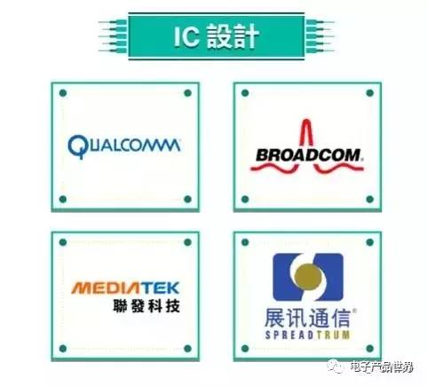

# 芯片产业链中不同公司的不同模式

* `IDM`=`整合组件制造商` 模式
    * =`全产业链`模式
        * =（设计，制造，封装，销售等）啥都干
    * 领导厂商
        * `Intel`、`德州仪器`=`TI`、`三星`
    * 特点
        * 集芯片设计、制造、封装、测试、销售等多个产业链环节于一身
    * 优势
        * 能在设计、制造等环节达到最佳优化，充分发挥技术极限
* `Foundry`=`代工厂` 模式
    * =只生产（芯片）不设计（芯片）
    * 领导厂商
        * `台积电`=`TSMC`、`联电`、`日月光`、`矽品`
        * 如图
          * 
          * 
    * 特点
        * 只负责制造、封装或测试的其中一个环节
            * 不负责芯片设计
    * 优势
        * 不承担商品销售、或电路设计缺陷的市场风险
            * IC 设计商才是做品牌营销、卖芯片产品的
        * 做代工，获利相对稳定
    * 劣势
        * 仰赖实体资产，投资规模甚巨、维持产线运作的费用高
* `Fabless`=`无厂IC设计商` 模式
    * =只设计（芯片）不生产（芯片）
    * 别称：
        * `Design House`
    *  领导厂商
        * `高通`=`Qualcomm`、`联发科`=`MTK`、`博通`=`Broadcom`、`展讯`
        * 如图
          * 
    * 特点
        * 只负责芯片的电路设计与销售
            * 将生产、测试、封装等环节外包
    * 优势
        * 无庞大实体资产，创始的投资规模小、进入门坎相对低，以中小企业为主
    * 劣势
        * 与IDM 企业相比，较无法做到完善的上下游工艺整合、较高难度的领先设计
* `Design Service`=`芯片设计服务提供商` 模式
    * =只为设计（芯片）提供服务（工具或`IP Core`）=辅助厂商或工具商
    * 背景：
        * IC 设计公司设计IC时
            * 他们会需要一些设计工具
            * 和一些辅助厂商的辅助和配合
    * 特点
        * 不设计和销售芯片
        * 为芯片设计公司提供相应的工具、完整功能单元、电路设计架构与咨询服务
        * 由于没有实体产品、而是贩卖知识产权IP“设计图”
            * 又称：`SIP`=`Silicon Intelligent Property`=`硅智能财产`=`硅智财`=`硅智产`
    * 优势
        * 无庞大实体资产。公司规模较小、资金需求不高，但对于技术的要求非常高
        * 不必负担产品销售的市场风险
    * 劣势
        * 市场规模较小且容易形成垄断，后进者难以打入
    * 厂商
        * `EDA`=`电子设计自动化` 工具
            * 作用
                * IC 设计工程师会先利用（`Verilog`、`VHDL`等）程序代码实现芯片功能
                    * 硬件功能是软件代码写成的
                * 而 EDA 工具能让程序代码再转成实际的电路图
                    * 然后通过
                        * `仿真`=`logic simulation`
                            * 可以用自动化逻辑综合工具去识别并自动转换 硬件描述语言 到 逻辑门级网表
                                * 使得硬件描述语言可以被用来进行电路系统设计，并能通过逻辑仿真的形式验证电路功能
                        * `综合`=`logic synthesis`
                            * 设计完成后，可以使用逻辑综合工具生成低抽象级别（门级）的网表（即连线表）
                    * 等工序转换为电路图
            * 典型厂商
              *  `Cadence`
                * `Synopsys`
                * `Imagination`
        * 辅助类
            * ARM
                * 特点
                    * 只设计内核
                        * 为芯片设计公司提供相应的功能单元
                            * `CPU Core`
                            * `FPU Core`
                            * `USB Core`
                            * 等等
                * 比如
                    * 希望芯片上能有一个浮点运算功能时
                    * 可以不用自己花时间从头开发
                    * 向ARM购买一个已经写好的功能即可
